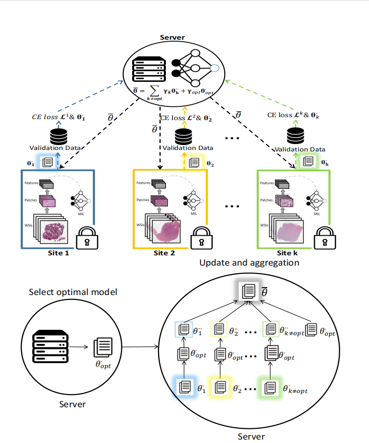

# FL-Dpu
Federated learning on whole slide images


# Preprocess/Setup
### Installation Guide for Linux (using Anaconda)
[Installation Guide](https://github.com/mahmoodlab/CLAM/blob/master/docs/INSTALLATION.md)

### Data Preparation
We chose to encode each tissue patch with a 1024-dim feature vector using a truncated, pretrained ResNet50. For each WSI, these features are expected to be saved as matrices of torch tensors of size N x 1024, where N is the number of patches from each WSI (varies from slide to slide). The following folder structure is assumed:
```bash
DATA_ROOT_DIR/
    └──classification_features_dir/
         ├── h5_files
                ├── TCGA_1.h5
                ├── TCGA_2.h5
                └── ...
         └── pt_files
                ├── TCGA_1.pt
                ├── TCGA_2.pt
                └── ...
```
DATA_ROOT_DIR is the base directory of all datasets (e.g. the directory to your SSD). DATASET_DIR is the name of the folder containing data specific to one experiment and features from each slide is stored as .pt files.

Please refer to refer to [CLAM](https://github.com/mahmoodlab/CLAM) for examples on how perform this feature extraction step.

Results by default are saved to **./results** folder. Predictions for each sample in the test set are stored in **.pkl** files under the directory specified --exp_code (see below).

# Classification 
use main.py --h for help on list of possible commandline arguments
See the definition of args.task in **main.py** for how to setup experiments with your own dataset (currently a dummy task is provided for illustration corresponding to the csv_file **dataset_csv/classification_fl_dummy_dataset.csv** and features stored under **DATA_ROOT_DIR/classification_features_dir**).
See **splits/classification_dummy** for examples on the expected format of train/val/test splits for k-fold experiments.


### Individual Site
Selecting data from a single institution for training can be done by specifying --inst_name NAME_OF_INSTITUTE. Example command for training on data from "institute_0" is as follows:
```
CUDA_VISIBLE_DEVICES=0 python main.py --k 5 --exp_code classification_institute_0_only --weighted_sample --task classification --inst_name institute_0 --data_root_dir DATA_ROOT_DIR --split_dir classification_dummy_100
```

### No FL (Centralized)
Training on data on all institutions without federated learning is toggled on using the --no_fl flag. 
``` shell
CUDA_VISIBLE_DEVICES=0 python main.py --k 5 --exp_code classification_no_fl --weighted_sample --task classification --no_fl --data_root_dir DATA_ROOT_DIR --split_dir classification_dummy_100
```

### FL with varying noise level (Gaussian Mechanism)
Training with federated averaging can be simulated by removing the --no_fl flag, as well as providing the level of noise (alpha parameter) via --noise_level. Example with alpha = 0.001 is as follows:
``` shell
CUDA_VISIBLE_DEVICES=0,1 python main.py --k 5 --exp_code classification_noise_0.001 --weighted_sample --task classification --noise_level 0.001 --weighted_fl_avg --data_root_dir DATA_ROOT_DIR --split_dir classification_dummy_100
```


### Dependent code
Our research is currently undergoing submission to the journal Biomedical Signal Processing and Control. We have utilized a portion of the source code from the following reference file: https://github.com/mahmoodlab/HistoFL. 

Our code improves on their work by:

Adding new functionality in ```eval.py```  ```create_splits.py```

Optimizing algorithms in ```utils/fl_utils.py``` ```utils/core_utils.py```  ```utils/eval_utils.py```

We thank the authors for their original codebase and encouragement of further research. 

### License
The code is released under GPL V3.

### Reference
If you use this code, please cite the following papers:
```
@article{LU2022102298,
title = {Federated learning for computational pathology on gigapixel whole slide images},
journal = {Medical Image Analysis},
volume = {76},
pages = {102298},
year = {2022},
doi = {https://doi.org/10.1016/j.media.2021.102298},
url = {https://www.sciencedirect.com/science/article/pii/S1361841521003431},
author = {Ming Y. Lu and Richard J. Chen and Dehan Kong and Jana Lipkova and Rajendra Singh and Drew F.K. Williamson and Tiffany Y. Chen and Faisal Mahmood},
}
```
